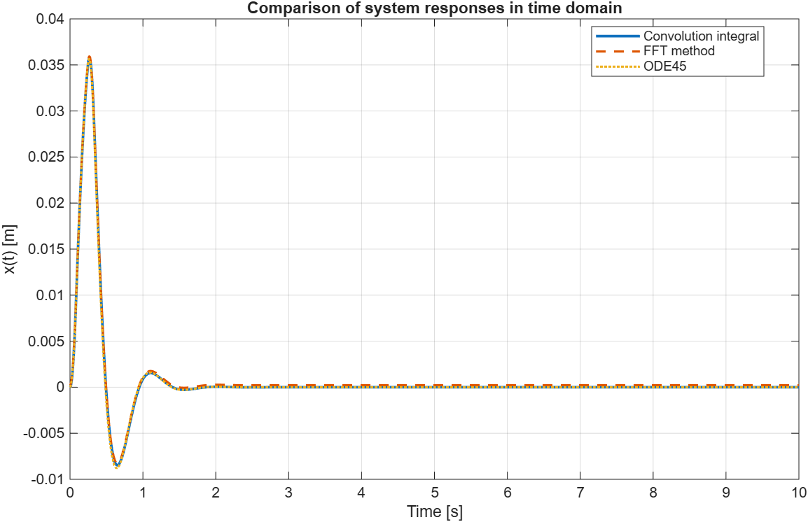
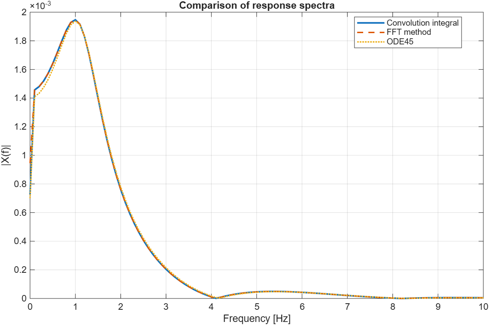

# Quarter-Car Suspension Simulation: Numerical Methods Comparison

An advanced MATLAB simulation analyzing a quarter-car suspension model subjected to a transient road disturbance. 

The project evaluates and compares **three distinct mathematical approaches** to solve the dynamic equations of a damped forced Single-Degree-of-Freedom (SDOF) system. The physical model is based on the real structural parameters of a **1994 Toyota Celica ST202**.

---

## 🛠️ Core Methodologies Compared

The system is excited by a dynamic **trapezoidal road bump** profile. The vertical response of the vehicle is calculated and cross-validated through:

1. **Time-Domain Convolution Integral:** Numerical approximation of the Duhamel integral by convolving the input forcing function with the system's analytical impulse response ($h_{imp}$).
2. **State-Space Direct Numerical Integration (ode45):** Standard Runge-Kutta 4th/5th-order variable step solver applied to the state-space formulation.
3. **Frequency-Domain Method (FFT):** Resolution through the Frequency Response Function (FRF) and inverse Fast Fourier Transform, using zero-padding to prevent wrap-around/periodic errors.

---

## 🏎️ Vehicle Parameters (Toyota Celica ST202)

| Parameter | Value | Description |
|---|---|---|
| **Quarter Mass ($m$)** | 400 kg | Equivalent mass of one corner of the vehicle |
| **Stiffness ($k$)** | 24,516.63 N/m | Suspension spring stiffness |
| **Damping ($c$)** | 2,985.65 N s/m | Viscous damping coefficient |
| **Natural Frequency ($f_n$)** | ~1.25 Hz | System undamped natural frequency |

---

## 📈 Key Insights & Engineering Metrics

* **Solver Convergence:** The three solvers show exceptional agreement in the time domain. The maximum absolute difference between the methods is tightly bounded below $10^{-6}$ meters, validating the mathematical consistency of the distinct implementations.
* **Spectral Analysis:** Fast Fourier Transform (FFT) post-processing isolates the energy distribution of the road impulse and clearly identifies the resonance peak around the system's natural frequency (~1.25 Hz).
* **Tire-Road Contact Check:** The script programmatically evaluates the dynamic contact force ($F_t$) acting on the ground, accounting for static gravity load ($m \cdot g$). It functions as a safety-critical check to detect wheel detachment ($F_t < 0$) during the transient rebound phase.

### Visual Results




---

## 🧮 Mathematical Model

The underlying governing equation of motion for the SDOF suspension system is:

$$m\ddot{x} + c\dot{x} + kx = c\dot{y} + ky$$

Where:
* $x(t)$, $\dot{x}(t)$, $\ddot{x}(t)$ represent the vehicle body displacement, velocity, and acceleration.
* $y(t)$ and $\dot{y}(t)$ represent the kinematic vertical displacement and velocity profile of the trapezoidal road bump.
* The equivalent forcing function is defined as: $F(t) = c\dot{y}(t) + ky(t)$.

---

## 🚀 How to Run the Project

1. Clone this repository to your local machine:
   
```bash
   git clone [https://github.com/filippodegliesposti/toyota-celica-st202-suspension-analysis.git](https://github.com/filippodegliesposti/toyota-celica-st202-suspension-analysis.git)
```

2. Open the main script quarter_car_simulation.m in MATLAB.

3. Run the script to generate time-history comparisons, acceleration curves, frequency spectra, and tire contact force verifications.

4. Quantitative metrics (Max displacement, RMS displacement/acceleration, and contact status) will be automatically printed in the MATLAB Command Window.